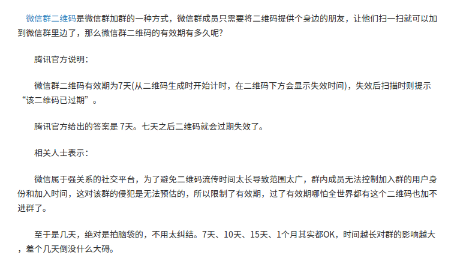

# gitinit

git init in jiaxin、hangzhou

study git.

study git every day.

two month.

four month.

## a new start from 2.10

**a good idea.**

*text*

~~come on~~

[vonbros](https://www.vonbros.com)

`top is ok`

* item
* item2

> quote is ok

==highlight==

(HR)

